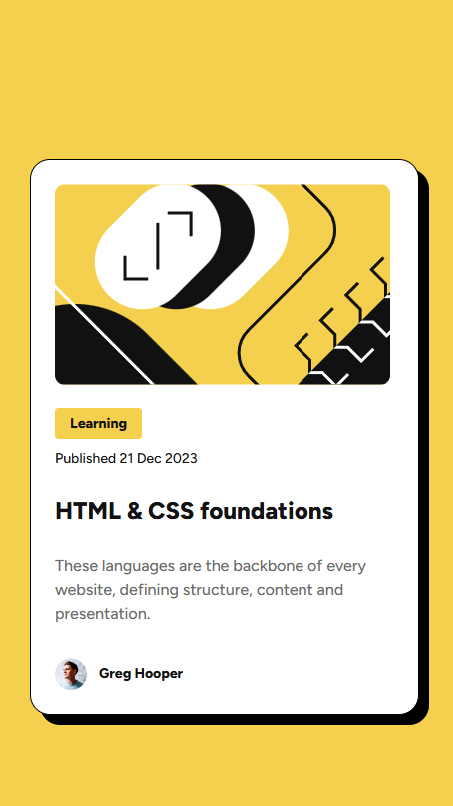

<<<<<<< HEAD
# Frontend Mentor - Blog Solution
=======
# Frontend Mentor - Blog Preview Solution
>>>>>>> c4115f4a74c22e486a7b499be4d1501347ba5fc3

This is a solution to the [Blog Preview Card challenge](https://www.frontendmentor.io/challenges/blog-preview-card-ckPaj01IcS) on Frontend Mentor. 

## Table of contents

- [Overview](#overview)
- [My process](#my-process)
  - [Tools](#built-with)
- [Reflections](#reflections)  
- [Author](#author)

## Overview
We were challenged to replicate a blog preview card
### Results

|Desired Outcome | Results|
|----------------|--------|
| | |

### Links
<<<<<<< HEAD
- [Live Site](https://taylor-mcneil.github.io/FrontendMentorSolutions/blog-preview-card-main/)
=======
- [Live Site](https://taylor-mcneil.github.io/FrontendMentorSolutions/blog-preview-card/)
>>>>>>> c4115f4a74c22e486a7b499be4d1501347ba5fc3

## My process
- Stubbed out all the HTML
- Added in CSS styles
    - Added the accessibility and hover styles

### Tools

- HTML
- CSS 
- Flexbox

## Reflections
I found this challenge interesting, we built on the skills learned in the previous lesson by adding interactivity with the on hover.

