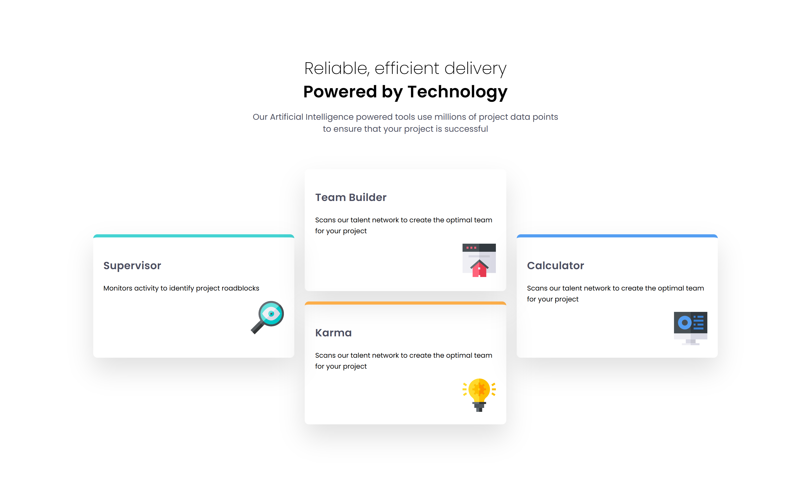
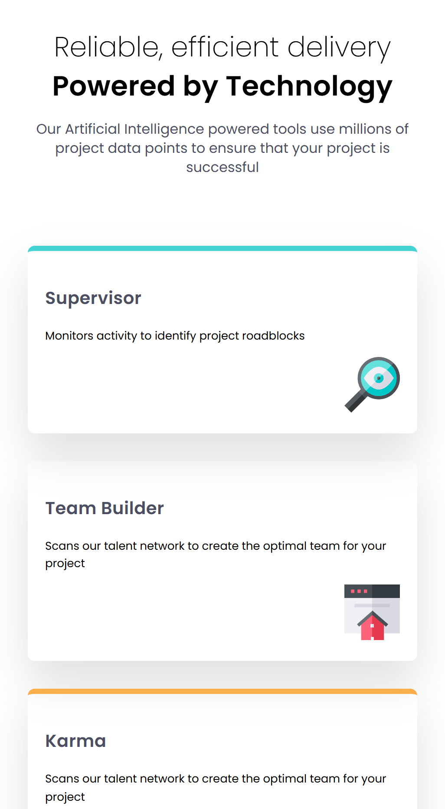

# Frontend Mentor - Four card feature section solution

This is a solution to the [Four Card Feature Section](https://www.frontendmentor.io/challenges/four-card-feature-section-weK1eFYK) challenge on Frontend Mentor.

## Table of contents

- [Overview](#overview)
- [My process](#my-process)
  - [Tools](#built-with)
- [Reflections](#reflections)  
- [Author](#author)

## Overview
We were challenged to use CSS Grid and or Flexbox to create this design. Overall the designt terrible but getting the grid to stay the same and move around on the different screen sizes was a bit of a challenge. I found that the tablet was actually the hardest to create. The desktop and mobile were quite easy.

### Results
|Desired Outcome | Results|
|----------------|--------|
|| 
|| 

### Links
- [Live Site](https://taylor-mcneil.github.io/FrontendMentorSolutions/four-cards)

### Tools

- HTML
- CSS 
- Flexbox
- CSS Grid
- React

## Reflections
Tbh I dont have much to say here other than... this wasnt my favorite challenge so far.

