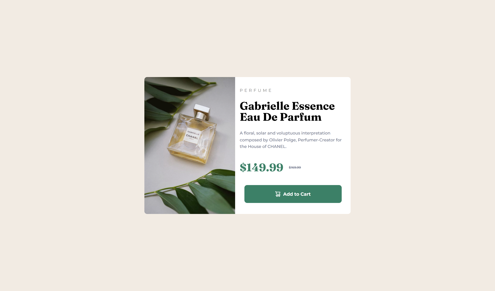

# Frontend Mentor - Product Preview Card Component Solution

This is a solution to the [Product Preview Card Component Solution](https://www.frontendmentor.io/challenges/product-preview-card-component-GO7UmttRfa) challenge on Frontend Mentor. 

## Table of contents

- [Overview](#overview)
- [My process](#my-process)
  - [Tools](#built-with)
- [Reflections](#reflections)  
- [Author](#author)

## Overview
We were challenged to replicate a product card component. This was an interesting project because it tested our knowledge on flex containers and responsive breakpoints.

### Results
|Desired Outcome | Results|
|----------------|--------|
| | |
|  | |

### Links
- [Live Site](https://taylor-mcneil.github.io/FrontendMentorSolutions/product-preview-card-component-main/)

### Tools

- HTML
- CSS 
- Flexbox

## Reflections
This challenge was pretty chill. It tested your eye for design in terms of the small details.