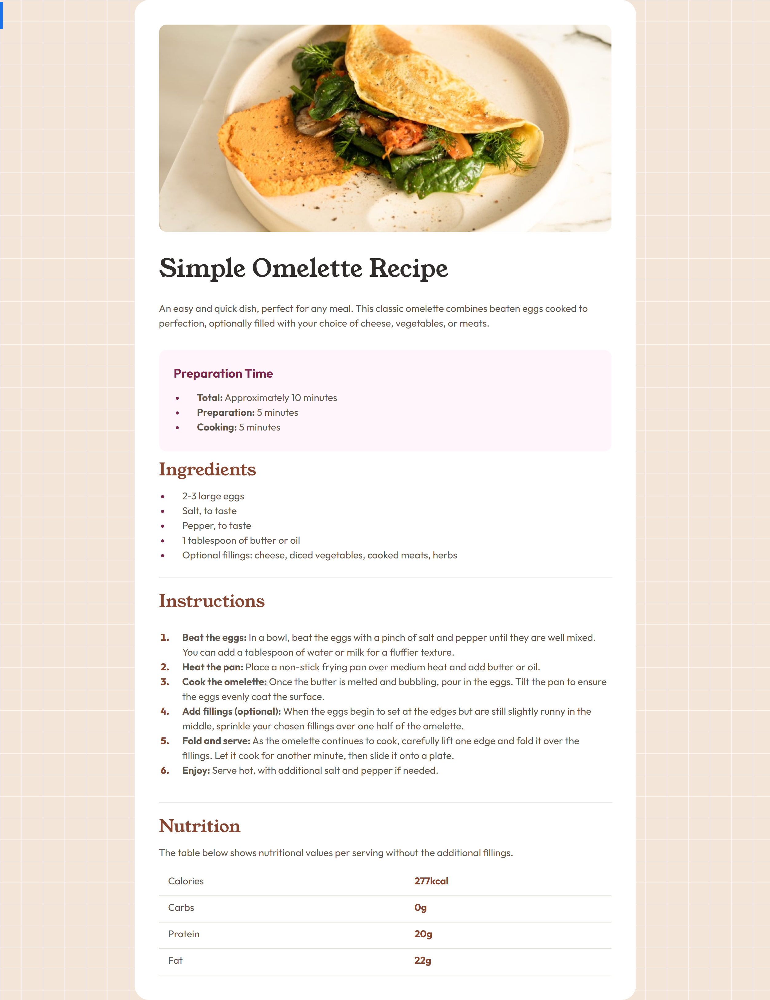

# Frontend Mentor - Recipe Page

This is a solution to the [Recipe page challenge on Frontend Mentor](https://www.frontendmentor.io/challenges/recipe-page-KiTsR8QQKm) challenge on Frontend Mentor. 

## Table of contents

- [Overview](#overview)
- [My process](#my-process)
  - [Tools](#built-with)
- [Reflections](#reflections)  
- [Author](#author)

## Overview
We were challenged to replicate a recipe page. This took us in a different direction learning about media queries, styling tables and lists.

### Results
|Desired Outcome | Results|
|----------------|--------|
| | |

### Links
- [Live Site](https://taylor-mcneil.github.io/FrontendMentorSolutions/recipe-page-main/)

## My process
- Stubbed out all the HTML
- Added in CSS styles

### Tools

- HTML
- CSS 
- Flexbox

## Reflections
This challenge was a bit annoying with the spacing for the lists, markers and tables. I did learn a lot from this challenge. I have a new found respect for making designs look nicer. I also am having fun trying to subtly tweak the designs.