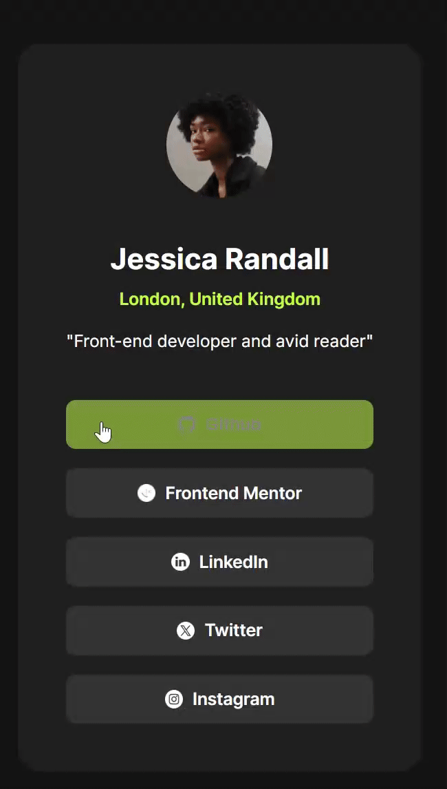

# Frontend Mentor - Social Links Profile Solution

This is a solution to the [Social Links Profile](https://www.frontendmentor.io/challenges/social-links-profile-UG32l9m6dQ) challenge on Frontend Mentor. 

## Table of contents

- [Overview](#overview)
- [My process](#my-process)
  - [Tools](#built-with)
- [Reflections](#reflections)  
- [Author](#author)

## Overview
We were challenged to replicate a social links preview card. This builds upon what we learned in the blog preview card by adding links and transitions.
### Results

|Desired Outcome | Results|
|----------------|--------|
| | |

### Links
- [Live Site](https://taylor-mcneil.github.io/FrontendMentorSolutions/social-links-profile-main/)

## My process
- Stubbed out all the HTML
- Added in CSS styles
    - Added the accessibility and hover styles

### Tools

- HTML
- CSS 
- Flexbox

## Reflections
I found this challenge to really fun. It took a minute to figure out how to get the transitions to work properly. I gave myself a lot of work trying to figure how to invert the icons to also match the transitions but it was fun to figure out. In hindsight, I don't know if I actually like the icons on the design, perhaps it was better without them. But I learned a lot from adding them in there.

